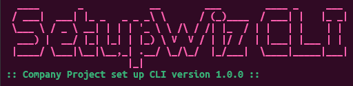
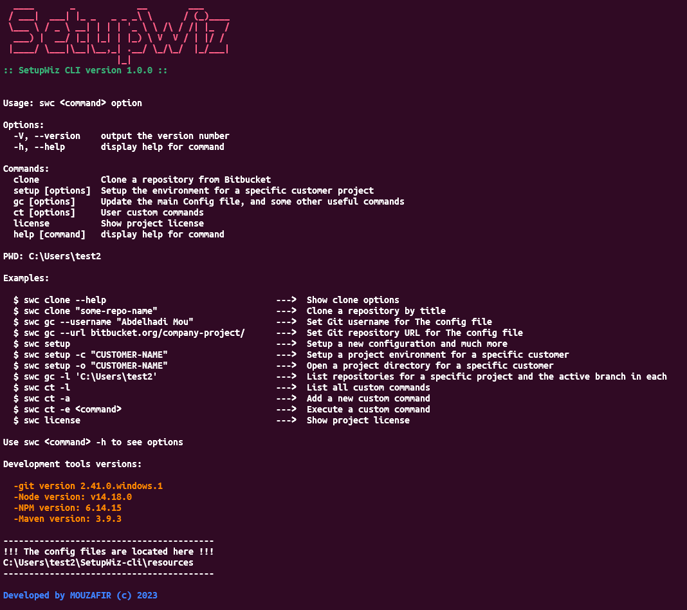

# SetupWiz CLI


[](https://badge.fury.io/js/setupwiz-cli)

SetupWiz CLI is a humble tool designed to make project switching and environment setup a breeze. Say goodbye to time-consuming configurations and hello to seamless transitions between your development projects.

<p align='center'>
    
</p>

## Features

- **Efficient Environment Setup**: Quickly configure your development environment with a single command.
- **Project Switching**: Easily switch between different projects and their associated configurations.
- **Simplified Workflow**: Reduce stress and save time during project transitions.
- **Custom Configuration**: Tailor your project settings and configurations to your needs.
- **Interactive Menus**: User-friendly menus to guide you through the process.

## Installation (For code explorers only)

1. Ensure you have [Node.js](https://nodejs.org/) installed.
2. Ensure you are in this project directory , `cd /path/to/project`.
3. Run `npm install` from the terminal within your project folder. This will install all necessary dependencies for the setup wizard.
4. Run `npm run l` to install the package globally in your os.
5. Verify installation by running `swc --version`. You should see the version of SetupWiz CLI displayed.

## Demo

<p align='center'>
    
</p>

## Usage

⚠️ For the first usage, it may prompt for a password. Just enter a random word, and it will generate the default one.

```bash
swc
```

1. After the first usage of the CLI, go to `homeDir/SetupWiz-cli/resources/cli`. (This path will be shown up in the CLI, at the bottom)
2. Open the file `banner.txt`, you will find something like `SetupWiz CLI, 205`.
3. Replace `205` with a valid ansi256 color number of you choice then save.
4. Open the file called `cli-description.txt` to update the description and save.
5. Re-launch the cli.

- If you decide to update `git-config.json`, you should go to `homeDir/SetupWiz-cli/resources`, it is the main config file the CLI depends on.

## Contribution

| Github Profile | Profile Image | username |
|--------------|---------------|------|
| [Mouzafir](https://github.com/abderox) |  | abderox |

## License

This project is licensed under the [MIT](./LICENSE) License.

© 2023 SetupWiz CLI
